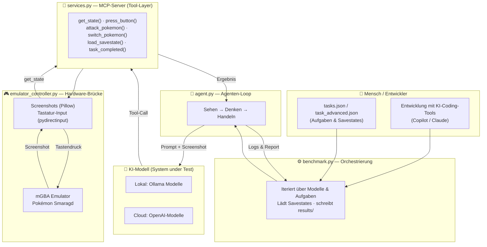

# Projekt-Proposal: Autonomous Pokémon Agent Framework

**Lehrveranstaltung:** Künstliche Intelligente Systeme (KIS)
**Thema:** AI-assisted Software Engineering
**Team (Gruppe G2):** Felix Döberl, Philipp Zauner
**Datum:** Juni 2026

---

## 1. Ziel des Projekts

### High-Level-Ziel

Wir entwickeln ein **Benchmarking-Framework**, das es ermöglicht, verschiedene Large Language Models (LLMs) – insbesondere Modelle mit Bildverarbeitung – als autonome Agenten in einer realen, visuell komplexen Umgebung (Pokémon Smaragd-Edition) gegeneinander antreten zu lassen und objektiv zu vergleichen.

Die Kernfrage lautet: **Wie gut können aktuelle (lokale wie cloud-basierte) LLM´s ein klassisches Videospiel anhand von Screenshots verstehen, planen und durch Tool-Calls steuern?**

### Wie wird das Ziel validiert?

Die Validierung erfolgt nicht subjektiv, sondern über das Benchmark-System mit klar definierten, reproduzierbaren Aufgaben (`tasks.json`, `task_advanced.json`):

- **Reproduzierbarkeit:** Jeder Agent startet von exakt definierten Spielständen (Savestates, z. B. „vor dem Pokémon-Center", „im hohen Gras", „vor dem Arenaleiter"). Dadurch sind die Läufe vergleichbar.
- **Objektive Erfolgsmetrik:** Eine Aufgabe gilt als gelöst, wenn der Agent das Tool `task_completed()` korrekt aufruft, nachdem er das Ziel erreicht hat (z. B. Kampf gewonnen, Pokémon geheilt, Item gekauft).
- **Messgrößen:** Erfolgsrate pro Modell und Aufgabe, Anzahl benötigter Schritte (`max_steps`), sowie bei API-Modellen die Kosten (Input/Cached/Output-Token).
- **Berichte:** `benchmark.py` speichert für jeden Lauf detaillierte Logs und einen Report im Ordner `results/`, sodass die Ergebnisse auswertbar und nachvollziehbar sind.

### Welches System / Feature / Workflow wird entwickelt?

Entwickelt wird ein vollständiger, modularer Software-Stack, der ein LLM mit einem laufenden Emulator verbindet:

1. **Hardware-Brücke** (`emulator_controller.py`): Findet das Emulator-Fenster, erstellt Screenshots und sendet echte Tastatur-/Maus-Befehle (`pydirectinput`).
2. **MCP-Server / Tool-Layer** (`services.py`): Stellt dem LLM standardisierte Werkzeuge über das Model Context Protocol bereit – `press_button()`, `get_state()`, `attack_pokemon()`, `switch_pokemon()`, `load_savestate()`, `task_completed()`.
3. **Agenten-Loop** (`agent.py`): Verbindet sich mit dem MCP-Server, spricht mit dem Modell (Ollama oder OpenAI), hält das Context-Window sauber und iteriert nach dem Muster *Sehen → Denken → Handeln*, bis die Aufgabe gelöst oder das Schritt-Limit erreicht ist.
4. **Benchmark-Orchestrierung** (`benchmark.py`): Iteriert über Modelle und Aufgaben, lädt Savestates, startet den Agenten und schreibt strukturierte Ergebnisberichte.

---

## 2. Wie trägt KI-Assistenz bei?

KI-Assistenz spielt in diesem Projekt auf **zwei Ebenen** eine Rolle:

### Ebene A – KI als Kern des Produkts (Laufzeit)

Das LLM **ist** das System under Test. Es übernimmt Wahrnehmung, Planung und Steuerung:

| Stage | Eingesetzte Modelle / Tools | Beitrag |
|---|---|---|
| Wahrnehmung | LLM´s mit Bildverarbeitung (z. B. `Qwen3.6-27B`, `Gemma4:12b`, `Gemma4:26b`) | Interpretieren den Screenshot: Wo stehe ich? Welcher Text steht im Dialog? |
| Planung / Reasoning | Lokale Ollama-Modelle **oder** OpenAI-Modelle (z. B. `gpt-5-nano`, `gpt-5-mini`) | Leiten aus Bild + Aufgaben-Prompt das nächste Teilziel ab |
| Aktion (Tool-Calling) | MCP-Server (`services.py`) | Das Modell ruft Tools auf, um konkrete Spielaktionen auszulösen |
| Selbst-Terminierung | `task_completed()` | Das Modell entscheidet eigenständig, wann eine Aufgabe erfüllt ist |

Der Vergleich **lokal (Ollama) vs. Cloud (OpenAI)** ist ein zentraler Untersuchungsgegenstand – inklusive der Trade-offs zwischen Kosten, Latenz, VRAM-Bedarf und Erfolgsrate.

### Ebene B – KI-Assistenz im Entwicklungsprozess (Build-Zeit)

Im Sinne des Lehrveranstaltungsthemas *AI-assisted Software Engineering* nutzen wir KI-Coding-Tools über den gesamten Entwicklungszyklus:

- **Scaffolding & Boilerplate:** KI-Coding-Assistenten (z. B. GitHub Copilot, Claude) zur Erstellung des MCP-Server-Grundgerüsts und der Emulator-Anbindung.
- **Debugging:** KI-gestützte Fehleranalyse bei plattformspezifischen Problemen (z. B. schwarze Screenshots im Multi-Monitor-Setup, `pydirectinput`-Berechtigungen).
- **Dokumentation:** KI-unterstütztes Verfassen von `README.md`, `Agents.md` und diesem Proposal.
- **Prompt-Engineering:** Iterative Verbesserung der Task-System-Prompts in `tasks.json` mit KI-Feedback.
- **Code-Review:** KI als zusätzliche Review-Instanz vor dem Merge.

Damit ist die KI im Projekt sowohl **Werkzeug der Entwicklung** als auch **Untersuchungsobjekt** – wir reflektieren am Ende, wo KI-Assistenz die Produktivität gesteigert hat und wo manuelle Eingriffe nötig blieben.

---

## 3. Architektur- / Entwicklungs-Diagramm

**Legende der Interaktion Mensch ↔ KI:** Der Mensch definiert Aufgaben und entwickelt das Framework (mit KI-Coding-Tools). Zur Laufzeit übernimmt das KI-Modell autonom die Steuerung; der Mensch greift nur noch zur Auswertung der Reports ein.

---

## 4. Projektplan

Das Projekt wird in Arbeitspakete (AP) mit team-internen Deadlines gegliedert. *(Daten sind Vorschläge und werden vom Team final festgelegt.)*

| AP | Arbeitspaket | Inhalt | Status | Interne Deadline |
|---|---|---|---|---|
| AP1 | Setup & Hardware-Brücke | Emulator-Anbindung, Screenshots, Input-Steuerung (`emulator_controller.py`) | ✅ erledigt | KW 21 |
| AP2 | MCP-Server / Tool-Layer | Tools definieren & testen (`services.py`) | ✅ erledigt | KW 21 |
| AP3 | Agenten-Loop | Ollama-Anbindung, Context-Management (`agent.py`) | ✅ erledigt | KW 22 |
| AP4 | Benchmark-Orchestrierung | Savestate-Handling, Reports, Metriken (`benchmark.py`) | ✅ erledigt | KW 22 |
| AP5 | Aufgaben-Design | Basis- & Advanced-Tasks, Prompt-Engineering (`tasks.json`) | 🔄 laufend | KW 22 |
| AP6 | OpenAI-Integration | API-Modelle anbinden, Kosten-Tracking | 🔄 laufend | KW 23 |
| AP7 | Benchmark-Durchläufe | Mehrere Modelle über alle Aufgaben evaluieren | ⬜ offen | KW 24 |
| AP8 | Auswertung & Analyse | Erfolgsraten, Schritte, Kosten vergleichen; Reflexion KI-Assistenz | ⬜ offen | KW 25 |
| AP9 | Dokumentation & Abgabe | Finaler Bericht / Präsentation | ⬜ offen | KW 25 |

---

## 5. Teamwork & Verantwortlichkeiten

| Teammitglied | Hauptverantwortung | Module |
|---|---|---|
| Döberl | Agent & Spiel-Anbindung | `agent.py`, `services.py`, `emulator_controller.py` |
| Zauner | Benchmark & Evaluation | `benchmark.py`, `tasks.json`, Auswertung & Reports |

**Gemeinsame Aufgaben:** Aufgaben-Design, Prompt-Engineering, Testläufe, Dokumentation und finale Präsentation werden gemeinsam bearbeitet.
